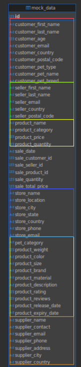
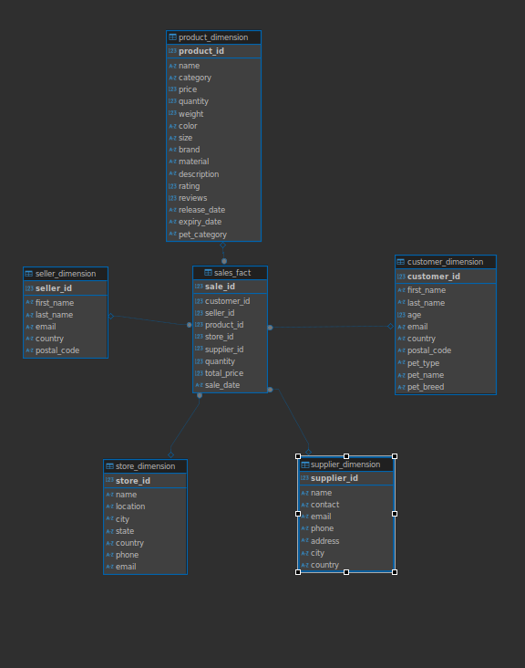

# Лабораторная работа №1
### Тема: нормализация данных в снежинку
#### Загрузка данных
К сожалению я не смог разобраться с автоматическим переводом данных в базу данных, так как идентификаторы в каждой таблице начинались заново, т.е. в каждой таблице идентификаторы были 1-1000. Поэтому я решил создать таблицу `mock_data` вручную. Затем с помощью инструмента DBeaver для загрузки данных из `.csv` в таблицы загрузил данные в таблицу `mock_data`. К сожалению из за этого не могу предоставить заполненные таблицы. У меня они локально хранятся в docker volume. Вот скрипт для создания таблицы (его можно посмотреть в файле [DDL.sql](DDL.sql)):
```sql
create table public.mock_data (
    id bigint generated always as identity primary key,
    customer_first_name varchar(50) NULL,
    customer_last_name varchar(50) NULL,
    customer_age integer NULL,
    customer_email varchar(50) NULL,
    customer_country varchar(50) NULL,
    customer_postal_code varchar(50) NULL,
    customer_pet_type varchar(50) NULL,
    customer_pet_name varchar(50) NULL,
    customer_pet_breed varchar(50) NULL,
    seller_first_name varchar(50) NULL,
    seller_last_name varchar(50) NULL,
    seller_email varchar(50) NULL,
    seller_country varchar(50) NULL,
    seller_postal_code varchar(50) NULL,
    product_name varchar(50) NULL,
    product_category varchar(50) NULL,
    product_price real NULL,
    product_quantity integer NULL,
    sale_date varchar(50) NULL,
    sale_customer_id bigint generated always as identity,
    sale_seller_id bigint generated always as identity,
    sale_product_id bigint generated always as identity,
    sale_quantity integer NULL,
    sale_total_price real NULL,
    store_name varchar(50) NULL,
    store_location varchar(50) NULL,
    store_city varchar(50) NULL,
    store_state varchar(50) NULL,
    store_country varchar(50) NULL,
    store_phone varchar(50) NULL,
    store_email varchar(50) NULL,
    pet_category varchar(50) NULL,
    product_weight real NULL,
    product_color varchar(50) NULL,
    product_size varchar(50) NULL,
    product_brand varchar(50) NULL,
    product_material varchar(50) NULL,
    product_description varchar(1024) NULL,
    product_rating real NULL,
    product_reviews integer NULL,
    product_release_date varchar(50) NULL,
    product_expiry_date varchar(50) NULL,
    supplier_name varchar(50) NULL,
    supplier_contact varchar(50) NULL,
    supplier_email varchar(50) NULL,
    supplier_phone varchar(50) NULL,
    supplier_address varchar(50) NULL,
    supplier_city varchar(50) NULL,
    supplier_country varchar(50) null
);
```
#### Анализ исходных данных
После первого взгляда на данные, я заметил, что в таблице также повторяются идентификаторы для заказчика, продавца и товара, т.е. в каждой таблице идут от 1 до 1000. При этом не было никакой логики в распределении этих идентификаторов: у одних и тех же товаров могли быть разные идентификаторы. Это мне показалось странным, но к сожалению я никак не могу сгруппировать эти данные и назначить им свои идентификаторы, поэтому пришлось поступить так же как и с основныме идентификатором, а именно генерировать их. По итогу получились идентификаторы от 1 до 1000000, но при этом они не повторяются там где не надо. Также, после дальнейшей аналитике, было выяснено, что даже данные в одной строке могли быть странными. Например, у покупателя была указана кошка в типе питомца, но при этом в породе питомца было указано Labrador-Retriever. Еще если взять какую то строку, посмотреть стоимость продукта и количество заказанных продуктов, то цена продажи несовпадет со стоимостью продукта умноженного на его количество, что тоже нелогично. И таких странностей было выявлено довольно много в дальнейшей аналитике, так как датасет скорее всего полностью сгенерированный, но это не мешает нам нормализовать эти данные в снежинку.
### Нормализация данных
Посмотрев на поля в таблице `mock_data`, можно четко выделить 5 измерений:

- Заказчик
- Продавец
- Поставщик
- Товар
- Магазин



И видим, что остаются продажи. Продажи мы отнесем к фактам, так как исходные данные, судя по всему, это именно информация о продажах. Создадим таблицы для измерений и фактов (можно посмотреть в файле [DDL.sql](DDL.sql)):
```sql
create table public.customer_dimension (
	customer_id bigint generated always as identity primary key,
	first_name varchar(50),
	last_name varchar(50),
	age integer,
	email varchar(50),
	country varchar(50),
	postal_code varchar(50),
	pet_type varchar(50),
	pet_name varchar(50),
	pet_breed varchar(50)
);

create table public.seller_dimension (
	seller_id bigint generated always as identity primary key,
	first_name varchar(50),
	last_name varchar(50),
	email varchar(50),
	country varchar(50),
	postal_code varchar(50)
);

create table public.product_dimension (
    product_id bigint generated always as identity primary key,
    name varchar(50),
    category varchar(50),
    price real,
    quantity integer,
    weight real,
    color varchar(50),
    size varchar(50),
    brand varchar(50),
    material varchar(50),
    description varchar(1024),
    rating real,
    reviews integer,
    release_date varchar(50),
    expiry_date varchar(50),
    pet_category varchar(50)
);

create table public.store_dimension (
    store_id bigint generated always as identity primary key,
    name varchar(50),
    location varchar(50),
    city varchar(50),
    state varchar(50),
    country varchar(50),
    phone varchar(50),
    email varchar(50)
);

create table public.supplier_dimension (
    supplier_id bigint generated always as identity primary key,
    name varchar(50),
    contact varchar(50),
    email varchar(50),
    phone varchar(50),
    address varchar(50),
    city varchar(50),
    country varchar(50)
);

create table public.sales_fact (
    sale_id bigint generated always as identity primary key,
    customer_id bigint references public.customer_dimension(customer_id),
    seller_id bigint references public.seller_dimension(seller_id),
    product_id bigint references public.product_dimension(product_id),
    store_id bigint references public.store_dimension(store_id),
    supplier_id bigint references public.supplier_dimension(supplier_id),
    quantity integer,
    total_price real,
    sale_date varchar(50)
);
```
Теперь у нас получилась такая схема в базе данных:


Теперь заполним эти таблицы данными (эти скрипты можно посмотреть в файле [DML.sql](DML.sql)):
```sql
insert into public.customer_dimension (first_name, last_name, age, email, country, postal_code, pet_type, pet_name, pet_breed)
select distinct customer_first_name, customer_last_name, customer_age, customer_email, customer_country, customer_postal_code, customer_pet_type, customer_pet_name, customer_pet_breed
from public.mock_data;

insert into public.seller_dimension (first_name, last_name, email, country, postal_code)
select distinct seller_first_name, seller_last_name, seller_email, seller_country, seller_postal_code
from public.mock_data;

insert into public.product_dimension (name, category, price, quantity, weight, color, size, brand, material, description, rating, reviews, release_date, expiry_date, pet_category)
select distinct product_name, product_category, product_price, product_quantity, product_weight, product_color, product_size, product_brand, product_material, product_description, product_rating, product_reviews, product_release_date, product_expiry_date, pet_category
from public.mock_data;

insert into public.store_dimension (name, location, city, state, country, phone, email)
select distinct store_name, store_location, store_city, store_state, store_country, store_phone, store_email
from public.mock_data;

insert into public.supplier_dimension (name, contact, email, phone, address, city, country)
select distinct supplier_name, supplier_contact, supplier_email, supplier_phone, supplier_address, supplier_city, supplier_country
from public.mock_data;

insert into public.sales_fact (customer_id, seller_id, product_id, store_id, supplier_id, quantity, total_price, sale_date)
select 
    (select customer_id from public.customer_dimension where first_name = customer_first_name and last_name = customer_last_name limit 1) as customer_id,
    (select seller_id from public.seller_dimension where first_name = seller_first_name and last_name = seller_last_name limit 1) as seller_id,
    (select product_id from public.product_dimension where name = product_name limit 1) as product_id,
    (select store_id from public.store_dimension where name = store_name limit 1) as store_id,
    (select supplier_id from public.supplier_dimension where name = supplier_name limit 1) as supplier_id,
    sale_quantity as quantity,
    sale_total_price as total_price,
    sale_date
from public.mock_data;
```
Итого мы нормализовали все исходные данные в схему снежинку, которая поможет структрировать данные в таблицах, а также ускорить выполнение запросов при взаимодействии с бд.
